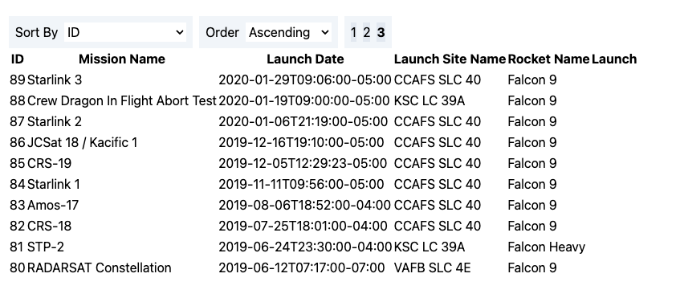

# Getting Started with Masterfile

This interview problem set has all the coding environment and boilerplate ready for you. Once complete, please create a zip folder containing all files except for `node_modules` and email to `garrett@masterfile.co and cc: joshua@masterfile.co` with `Frontend Interview - Your Name` in the subject line.

The boilerplate is setup to use the ff:

- yarn
- react
- redux-toolkit
- tailwindcss

All components must be functional components. Feel free to add any dependencies you see fit. You can add comments where you see fit to document your thought process for solving these problems.

## Problem

For this problem we want to fetch data from the SpaceX graphql endpoint and display it in a table.

Endpoint: https://api.spacex.land/graphql/

### Requirements:

1. Display list of `launchesPast` in a table with columns:

- id
- mission name
- launch date local
- rocket name
- launch site name
- launch success

2. Use GraphQL, you're free to use and to install any fetch (API/library e.g: fetch, axios, apollo, RTK Query, swr etc...)

3. Fetch the data from https://api.spacex.land/graphql/ endpoint.

4. List 10 item-row per page

5. Support up to 3 pages only

6. Add functionality to sort by the ff properties:

- id
- mission name
- launch date local
- rocket name
- launch site name
- launch success,

  Check this [link](https://github.com/SpaceXLand/api/blob/master/src/utils/filters/sort.ts) as your reference on what `sort` query values are accepted by the api.

7. Add functionality to arange the sorting by the ff order:

- ascending
- descending

8. Add the sort states to a redux slice

9. The list should update every time the sort , order and page reducer state updates.

10. The ff are the default states on the redux, you're free to add the other necessary default states and additional states you may need:

```
sort = 'ID'
order='descending'
page= 1
```

#### Key Notes:

- This exam is made to assess your core technical and react+redux skills.
- Do not overthink about the result, it is as straight forward as it is.
- Do not worry about the styling, we grade you base on the implementation not the presentation, just in case you need some small modification, use tailwindcss that was already setup.

#### Sample output with ff states:

- sortBy: id, order: acending, pageNumber: 3

  
